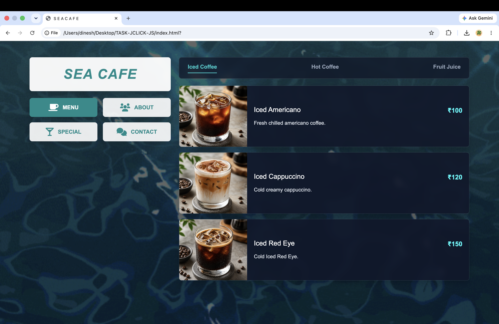
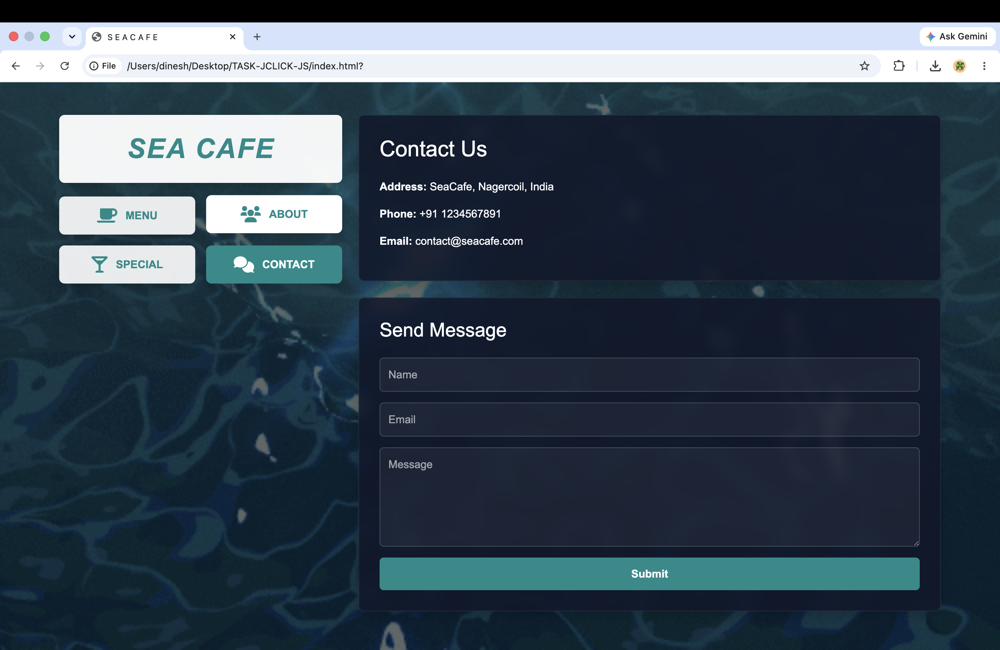

# ❁ Sea Cafe — Web Application

A clean, responsive, and feature-rich single-page cafe web application developed as a major HTML, CSS, Bootstrap, and JavaScript project at **JClick Solutions**. Built with a sleek dark-glassmorphism UI aesthetic, smooth transitions, and dynamic tabbed navigation.

---

## ◩ Project Context

* **Institution:** JClick Solutions
* **Curriculum:** HTML, CSS, Bootstrap, and JavaScript Major Project
* **Project Type:** Single-Page Application (SPA)

---

## ◪ Preview

|                         Home Page                        |                       Feedback Interaction                       |
| :------------------------------------------------------: | :--------------------------------------------------------------: |
|  |  |

---

## ❂ Features

* **Single-Page Architecture (SPA):** Seamless switching between *Menu*, *About*, *Special*, and *Contact* sections without page reloads using vanilla JavaScript.
* **Dynamic Menu Sub-Navigation:** Interactive category filtering for *Iced Coffee*, *Hot Coffee*, and *Fruit Juice*.
* **Interactive Contact Form:** Client-side validation and event handling featuring a success confirmation pop-up alert upon submission.
* **Modern Aesthetic:** Styled with dark transparent glassmorphism cards, backdrop blurring, custom layout structures, and vibrant color accents.
* **Fully Responsive:** Adapts fluidly across all screen sizes with sticky sidebar navigation using Bootstrap 5 grid systems.

---

## ⌘ Built With

  
  
  
  

* **Markup:** HTML5
* **Styling:** CSS3, Bootstrap 5.3
* **Interactivity:** JavaScript (ES6)
* **Icons:** Font Awesome 6
